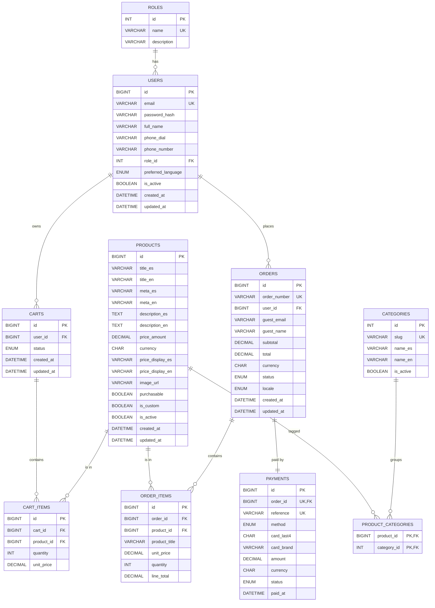

## 1. Contexto y supuestos

- **Dominio detectado en `client/`**: marketplace educativo STEM con catálogo bilingüe (ES/EN), carrito en `localStorage`, checkout simulado y panel admin que gestiona productos y usuarios. Categorías canónicas: `science, technology, engineering, mathematics, neurodiversity, certification, physical, dissidents`. Pago simulado con tarjeta (`LUD-xxxxx`). Roles: `admin` y `user`.
- **Decisiones confirmadas**:
  - Alcance **estándar (~10 tablas)**.
  - Traducciones como **columnas duplicadas** (`title_es/en`, `description_es/en`, `meta_es/en`, `price_display_es/en`).
  - Ubicación: **`luddiesHoldings/server/src_db/main/resources/db/`**.
- **Entregables (3 archivos requeridos)**:
  - `diagrama.mwb` — binario nativo de MySQL Workbench. *No se puede generar desde código.* Lo generaremos haciendo **Reverse Engineer** en Workbench a partir de `create.sql` (instrucciones incluidas).
  - `create.sql` — DDL completo con FK, índices y `CHECK`s.
  - `insert.sql` — datos de muestra ejecutables en orden.

## 2. Modelo entidad-relación (10 tablas)



### Reglas / restricciones clave
- `users.email` y `categories.slug` son **UNIQUE**.
- `users.role_id` referencia `roles.id` (`ADMIN`, `USER`).
- `product_categories` es la junction **N:M** que reemplaza el string de categorías hoy almacenado en `localStorage`.
- `orders.user_id` es **NULLABLE** para soportar el flujo guest del checkout actual; en ese caso se llenan `guest_email` / `guest_name`. **CHECK**: al menos uno de los dos grupos debe estar presente.
- `payments.order_id` es **UNIQUE** (1:1 con la orden).
- `cart_items` tiene **UNIQUE (cart_id, product_id)** para reflejar la regla del front: cada producto aparece una sola vez en el carrito.
- Todas las tablas en **InnoDB** y `utf8mb4_unicode_ci` (necesario para acentos del catálogo en español).

## 3. Estructura de archivos a crear

```
luddiesHoldings/
└── server/
    └── src/
        └── main/
            └── resources/
                └── db/
                    ├── diagrama.mwb        ← se genera con Workbench (Reverse Engineer)
                    ├── create.sql          ← DDL completo
                    ├── insert.sql          ← datos de muestra
                    └── README.md           ← cómo correr los scripts y generar .mwb
```

## 4. Contenido de `create.sql` (esquema de lo que generaré)

- `DROP DATABASE IF EXISTS luddies_holdings; CREATE DATABASE ... DEFAULT CHARACTER SET utf8mb4 COLLATE utf8mb4_unicode_ci; USE luddies_holdings;`
- `CREATE TABLE` para las 10 tablas en este orden (respeta dependencias FK):
  1. `roles`
  2. `users`
  3. `categories`
  4. `products`
  5. `product_categories`
  6. `carts`
  7. `cart_items`
  8. `orders`
  9. `order_items`
  10. `payments`
- Índices secundarios sobre `users.email`, `products.title_es`, `orders.order_number`, `orders.user_id`, `payments.reference`.
- `CHECK (price_amount >= 0)`, `CHECK (quantity > 0)`, `CHECK (card_last4 REGEXP '^[0-9]{4}$')`.
- Comentarios `-- Sección` para que sea legible al revisarlo.

## 5. Contenido de `insert.sql` (datos de muestra)

- **2 roles**: `ADMIN`, `USER`.
- **8 categorías** con `slug` + nombres ES/EN (matchean los filtros del catálogo en `client/html/catalog.html`).
- **6 usuarios**: 1 `ADMIN` (`admin@luddies.com.mx`) + 5 customers (passwords como bcrypt placeholder, p. ej. `$2a$10$...` para que Spring Security pueda validar después).
- **12 productos** alineados con el seed actual (`js/catalog-seed.js`) + 2 personalizados (`is_custom = TRUE`), con sus columnas ES/EN llenas y `price_amount` numérico real (ej. `199.00`, `1299.00`).
- **~20 filas** en `product_categories` (varios productos con múltiples categorías, p. ej. `certification + mathematics`).
- **3 carritos** (1 ACTIVE, 1 CONVERTED, 1 ABANDONED) con sus `cart_items`.
- **3 órdenes** (1 PAID con guest, 2 PAID con usuarios registrados) con `order_items` (snapshot de título y precio).
- **3 pagos** correspondientes con `reference` formato `LUD-XXXXX` (igual al que produce `js/payment.js`).

Las inserciones usarán `INSERT ... VALUES` por bloques y respetarán el orden de FKs. Idempotente al re-ejecutar `create.sql` (porque hace `DROP DATABASE IF EXISTS`).

## 6. Sobre `diagrama.mwb`

El formato `.mwb` es **binario propietario de MySQL Workbench** y no se puede generar desde un script. El `README.md` incluirá los pasos:

1. Abrir MySQL Workbench → `Database` → `Reverse Engineer...`.
2. Conectar al servidor donde corriste `create.sql`, seleccionar `luddies_holdings`.
3. Workbench arma el diagrama EER automáticamente.
4. `File` → `Save Model As...` → guardar como `diagrama.mwb` en la misma carpeta `db/`.

(Alternativa offline: `File` → `New Model` → `File` → `Import` → `Reverse Engineer MySQL Create Script...` apuntando a `create.sql` — no requiere servidor.)

## 7. Aproximación MVC del backend Spring Boot (alta vista)

Solo como referencia para que el esquema encaje; NO se implementará en esta iteración (la petición es la "aproximación" enfocada en BD):

- `server/` será un proyecto Maven Spring Boot 3.x + Java 17 con dependencias `spring-boot-starter-web`, `spring-boot-starter-data-jpa`, `mysql-connector-j`, `spring-boot-starter-security`, `spring-boot-starter-validation`, `lombok`.
- Paquete base sugerido: `com.luddiesholdings.api`.
  - `model/` (entidades JPA: `User`, `Role`, `Product`, `Category`, `Cart`, `CartItem`, `Order`, `OrderItem`, `Payment`).
  - `repository/` (interfaces JPA).
  - `service/` (lógica de negocio).
  - `controller/` (endpoints REST: `AuthController`, `ProductController`, `CategoryController`, `CartController`, `OrderController`, `AdminController`).
  - `dto/`, `mapper/`, `config/`, `security/`.
- `application.properties` apuntará a `jdbc:mysql://localhost:3306/luddies_holdings` y `spring.jpa.hibernate.ddl-auto=validate` (para que el esquema lo controle nuestro `create.sql`, no Hibernate).

## 8. Criterios de aceptación

- `create.sql` se ejecuta de principio a fin sin errores en MySQL 8.x.
- `insert.sql` se ejecuta después de `create.sql` sin errores y deja al menos una fila en cada tabla.
- El diagrama ER refleja las 10 tablas con sus relaciones, cardinalidades y PK/FK marcadas.
- Los 3 archivos viven en `luddiesHoldings/server/src_db/main/resources/db/`.
- Los datos de muestra son consistentes con el catálogo actual del cliente (mismas categorías y al menos los mismos productos seed).